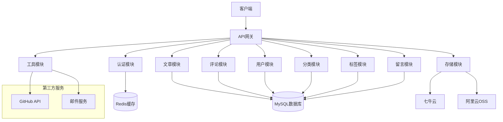

# Sunrise Blog

## 项目介绍

Sunrise Blog 是一个基于 NestJS 框架开发的现代化博客系统后端服务。该项目采用模块化架构，提供了完整的博客功能，包括文章管理、用户认证、评论系统、分类标签管理等功能。系统使用 MySQL 作为主数据库，Redis 作为缓存，支持文件存储到七牛云或阿里云。

## 技术栈

- **框架**: NestJS
- **数据库**: MySQL
- **缓存**: Redis (ioredis)
- **认证**: JWT
- **ORM**: TypeORM
- **日志**: Winston
- **文档**: Swagger
- **容器化**: Docker
- **包管理**: Bun

## 项目结构

```
src/
├── apps/                    # 应用模块
│   ├── article/            # 文章模块
│   ├── article-comments/   # 文章评论模块
│   ├── auth/               # 认证模块
│   ├── categories/         # 分类模块
│   ├── config/             # 配置模块
│   ├── github-commit/      # GitHub提交记录模块
│   ├── github-repositories/ # GitHub仓库模块
│   ├── message/            # 留言板模块
│   ├── sitemap/            # 网站地图模块
│   ├── storage/            # 文件存储模块
│   ├── tags/               # 标签模块
│   ├── third-party-library/ # 第三方库模块
│   ├── tools/              # 工具模块
│   ├── user/               # 用户模块
│   └── visit-log/          # 访问日志模块
├── decorators/             # 装饰器
├── guard/                  # 守卫
├── interceptor/            # 拦截器
├── types/                  # 类型定义
└── utils/                  # 工具函数
```

## 系统架构



## 核心功能模块

### 1. 用户认证与权限管理

- JWT Token 认证
- 基于角色的权限控制 (RBAC)
- OTP 二次验证
- 用户注册、登录、信息管理

### 2. 文章管理系统

- 文章的增删改查
- 文章分类与标签
- 文章评论功能
- 文章浏览统计
- 文章时间轴
- 文章推荐与置顶

### 3. 内容管理

- 分类管理
- 标签管理
- 评论管理
- 留言板管理

### 4. 文件存储

- 支持七牛云存储
- 支持阿里云OSS存储
- 文件上传与管理

### 5. 第三方集成

- GitHub 仓库与提交记录同步
- 邮件通知服务
- 网站地图生成

## API 设计

### 认证相关 API

```
POST /api/auth/login          # 用户登录
POST /api/auth/register       # 用户注册
POST /api/auth/refresh        # 刷新Token
GET  /api/auth/profile        # 获取用户信息
PUT  /api/auth/profile        # 更新用户信息
```

### 文章相关 API

```
GET    /api/article           # 获取文章列表
GET    /api/article/:id       # 获取文章详情
POST   /api/article           # 创建文章
PUT    /api/article/:id       # 更新文章
DELETE /api/article/:id       # 删除文章
GET    /api/article/timeline  # 获取文章时间轴
GET    /api/article/prevNext/:id  # 获取上一篇和下一篇文章
```

### 评论相关 API

```
GET    /api/article-comments      # 获取评论列表
GET    /api/article-comments/:id  # 获取评论详情
POST   /api/article-comments      # 创建评论
PUT    /api/article-comments/:id  # 更新评论
DELETE /api/article-comments/:id  # 删除评论
```

### 分类和标签 API

```
# 分类
GET    /api/categories           # 获取分类列表
GET    /api/categories/:id       # 获取分类详情
POST   /api/categories           # 创建分类
PUT    /api/categories/:id       # 更新分类
DELETE /api/categories/:id       # 删除分类

# 标签
GET    /api/tags                 # 获取标签列表
GET    /api/tags/:id             # 获取标签详情
POST   /api/tags                 # 创建标签
PUT    /api/tags/:id             # 更新标签
DELETE /api/tags/:id             # 删除标签
```

### 用户管理 API

```
GET    /api/user                 # 获取用户列表
GET    /api/user/:id             # 获取用户详情
POST   /api/user                 # 创建用户
PUT    /api/user/:id             # 更新用户
DELETE /api/user/:id             # 删除用户
```

### 留言板 API

```
GET    /api/message              # 获取留言列表
GET    /api/message/:id          # 获取留言详情
POST   /api/message              # 创建留言
PUT    /api/message/:id          # 更新留言
DELETE /api/message/:id          # 删除留言
```

## 安装与运行

### 环境要求

- Node.js 18+
- MySQL 8.0+
- Redis 6.0+
- Bun (推荐) 或 npm/yarn

### 本地开发

1. 克隆仓库
```bash
git clone [repository-url]
cd sunrise_blog
```

2. 安装依赖
```bash
bun install
```

3. 配置环境变量
创建 `.env.local` 文件，配置数据库连接等信息。

4. 启动开发服务器
```bash
bun run dev
```

### 生产部署

1. 构建项目
```bash
bun run build
ncc build dist/main.js -m -o dist1
```

2. Docker 部署
```bash
docker build -t sunrise-blog . --progress=plain --no-cache
docker run -p 2345:2345 sunrise-blog
```

## API 文档

启动服务后，可以通过以下地址访问 API 文档：
- Swagger UI: http://localhost:2345/doc

## 贡献指南

1. Fork 本仓库
2. 创建您的特性分支 (`git checkout -b feature/AmazingFeature`)
3. 提交您的更改 (`git commit -m 'Add some AmazingFeature'`)
4. 推送到分支 (`git push origin feature/AmazingFeature`)
5. 打开一个 Pull Request

## 许可证

本项目采用 UNLICENSED 许可证。

## 联系方式

如有问题或建议，请通过以下方式联系：
- 邮箱: [your-email@example.com]
- GitHub Issues: [repository-issues-url]
