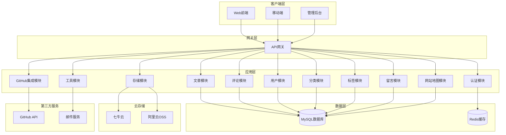
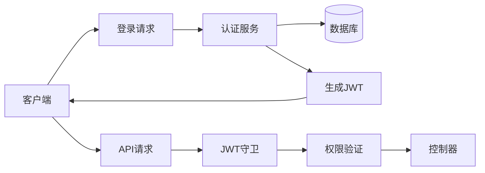
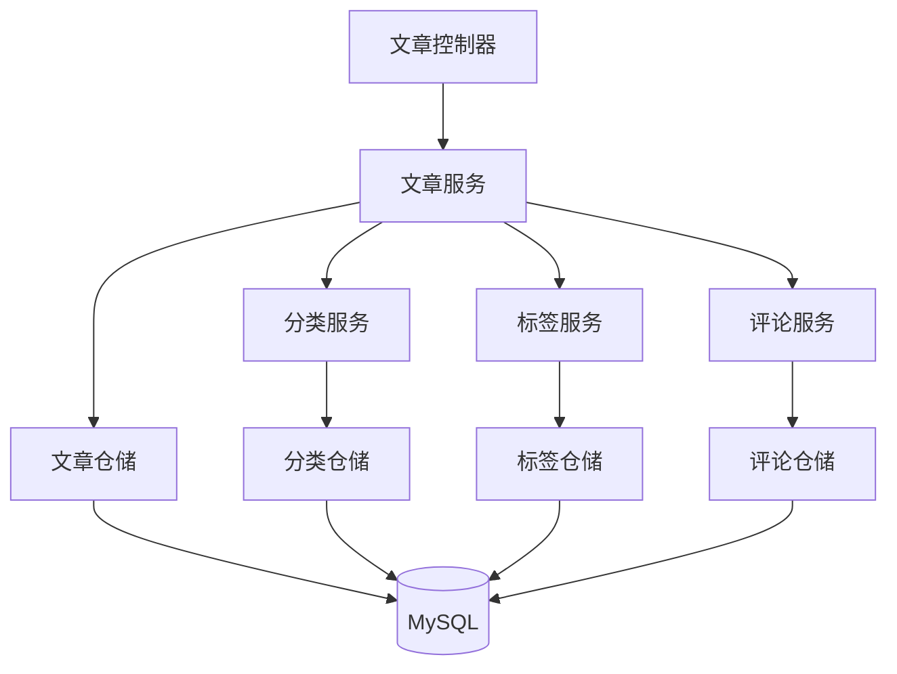
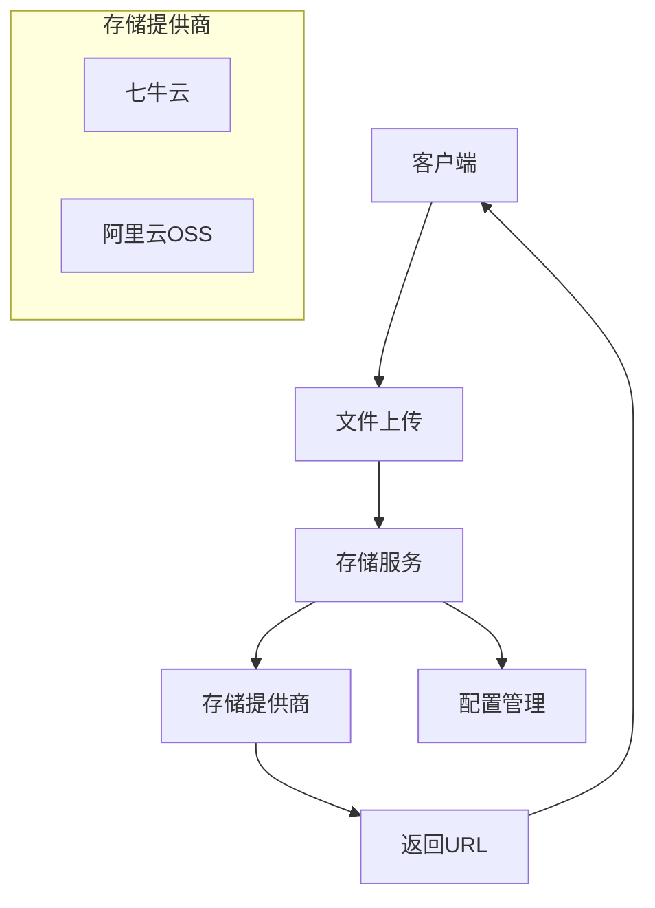

# Sunrise Blog 系统架构图

## 整体架构

```mermaid
graph TB
    subgraph "客户端层"
        Web[Web前端]
        Mobile[移动端]
        Admin[管理后台]
    end

    subgraph "网关层"
        Gateway[API网关]
    end

    subgraph "应用层"
        Auth[认证模块]
        Article[文章模块]
        Comment[评论模块]
        User[用户模块]
        Category[分类模块]
        Tag[标签模块]
        Message[留言模块]
        Storage[存储模块]
        Tools[工具模块]
        Sitemap[网站地图模块]
        GitHub[GitHub集成模块]
    end

    subgraph "数据层"
        MySQL[(MySQL数据库)]
        Redis[(Redis缓存)]
    end

    subgraph "云存储"
        Qiniu[七牛云]
        Aliyun[阿里云OSS]
    end

    subgraph "第三方服务"
        GithubAPI[GitHub API]
        Email[邮件服务]
    end

    Web --> Gateway
    Mobile --> Gateway
    Admin --> Gateway

    Gateway --> Auth
    Gateway --> Article
    Gateway --> Comment
    Gateway --> User
    Gateway --> Category
    Gateway --> Tag
    Gateway --> Message
    Gateway --> Storage
    Gateway --> Tools
    Gateway --> Sitemap
    Gateway --> GitHub

    Auth --> Redis
    Article --> MySQL
    Comment --> MySQL
    User --> MySQL
    Category --> MySQL
    Tag --> MySQL
    Message --> MySQL
    Sitemap --> MySQL

    Storage --> Qiniu
    Storage --> Aliyun

    GitHub --> GithubAPI
    Tools --> Email
```

## 认证与权限架构

```mermaid
graph LR
    Client[客户端] --> Login[登录请求]
    Login --> Auth[认证服务]
    Auth --> DB[(数据库)]
    Auth --> Token[生成JWT]
    Token --> Client
    Client --> API[API请求]
    API --> Guard[JWT守卫]
    Guard --> Permission[权限验证]
    Permission --> Controller[控制器]
```

## 文章管理模块架构

```mermaid
graph TB
    Controller[文章控制器] --> Service[文章服务]
    Service --> Repository[文章仓储]
    Repository --> DB[(MySQL)]

    Service --> CategoryService[分类服务]
    Service --> TagService[标签服务]
    Service --> CommentService[评论服务]

    CategoryService --> CategoryRepository[分类仓储]
    TagService --> TagRepository[标签仓储]
    CommentService --> CommentRepository[评论仓储]

    CategoryRepository --> DB
    TagRepository --> DB
    CommentRepository --> DB
```

## 文件存储架构

```mermaid
graph TB
    Client[客户端] --> Upload[文件上传]
    Upload --> StorageService[存储服务]
    StorageService --> Provider[存储提供商]

    subgraph "存储提供商"
        Qiniu[七牛云]
        Aliyun[阿里云OSS]
    end

    Provider --> URL[返回URL]
    URL --> Client

    StorageService --> Config[配置管理]
```
